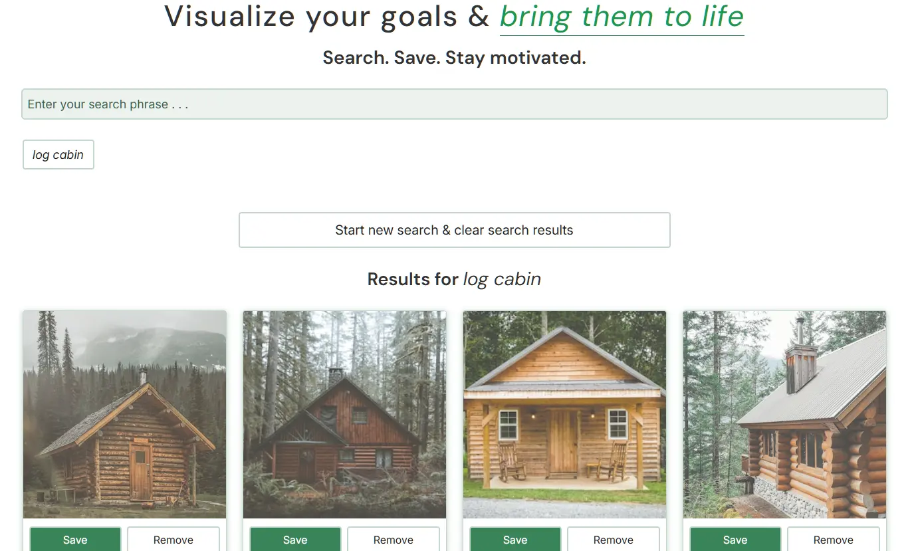
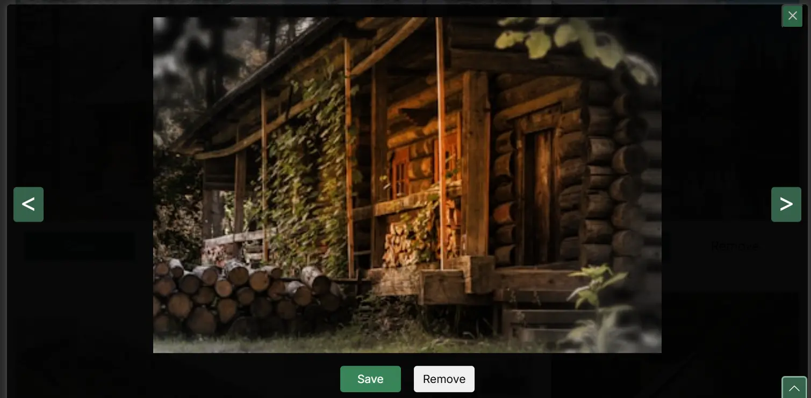
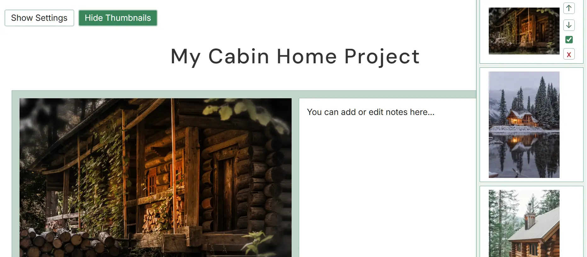

<h1 id="back-to-top">VisualGrid – Visual Project Planning App Using the Unsplash API</h1>


VisualGrid is a client-side web app for visual project planning and goal setting that helps users collect inspiration and organize ideas using images from the Unsplash API.

Users can attach notes or goal statements to each image and revisit their saved ideas later. The app includes modal image previews, a full-screen slider, and localStorage persistence for managing and organizing saved images.

<br>

<div align="center"></div>

<p align="center"><em>Home page image modal with Save, Remove and navigation buttons</em></p>

<br>

## Features

### Home / Search Page

<br>


<p align="center"><em>Home page image modal with Save, Remove and navigation buttons</em></p>

<br>

- Image Search
  - Enter a search phrase to fetch 12 images from the Unsplash API.
  - Past search terms are saved and can be revisited, each automatically loading the next page of results.
- Image Cards
  - View each image in compact form in the cards that are created from your search.
  - Save or remove images directly from the cards.
  - Click any image to view a larger, aspect-correct version in a modal.
- Modal Viewer
  - Navigate through all images currently loaded on the page.
  - You can also save or remove images from within the modal.
- Load More
  - The "Load More" button fetches the next page of images for the current search.

### Vision Board Page

<br>


<p align="center"><em>Board page thumbnails strip on right & image with editable text field</em></p>

<br>

- Saved Images Display
  - View all saved images in a large, clean layout.
  - Each image includes an editable text area for notes persisted via localStorage.
- Thumbnail Strip
  - See all saved items in a compact strip for quick navigation.
  - Clicking on any thumbnail takes you to that image on the page.
  - Reorder saved images by moving them up or down.
  - Delete images and their notes from your project.
  - Choose to show or hide the image in the lightbox slider (_WIP_)
  - Click the page image or editable text box to close the thumbnail strip.
- Affirmation / Goal Statement
  - Click any saved image on the page to open a modal with a larger view.
  - Add an affirmation or goal statement for that image (115-character limit).
  - Navigate to other saved images within the modal to quickly update each affirmation.
  - These affirmations are shown in the full-screen slider instead of your page notes.
- Lightbox Slider
  - A full-screen modal that cycles through saved images.
  - The slider also displays the image's affirmation/goal statement created in the modal.
  - Adjustable timing between slides (6, 8, 10, 15 or 20 seconds).

<div align="right">&#8673; <a href="#back-to-top">Back to Top</a></div>

<br>

## Demo / Live Site

Try the project here: https://vision-grid.onrender.com/

<br>

## Technologies Used

| Tool       | Version    |
| :--------- | :--------- |
| Node.js    | `v22.20.0` |
| npm        | `10.9.3`   |
| Express.js | `^5.2.0`   |

## Installation

<br>

1. Clone this repo and install dependencies:

```bash
# Clone this repo
git clone https://github.com/Kernix13/vision-grid-express.git

# Change into project directory
cd vision-grid-express

# Install dependencies
npm install
```

<br>

2. Create a `.env` file in the project root. Copy the lines in `.env.example` and paste them into your newly created `.env` file.

```env
CLIENT_ID=your_unsplash_client_id
PORT=port_number
```

<br>

3. Replace the string `your_unsplash_client_id` with your Unsplash API Client ID, and `port_number` to `8080` or with the port you want to use. Delete the file `.env.example`.

### Getting an Unsplash API key

Visit https://unsplash.com/developers and create an API application.

## Usage

1. Start the development server:

```sh
npm run dev
```

<br>

2. <kbd>CTRL</kbd> + click the link `http://localhost:8080` in the terminal to open up `localhost` on port `8080`:

```sh
Server is running http://localhost:8080
```

You can now search for images using the Unsplash API, save images to your board page, add notes for each saved image, etc.

<br>

3. **(OPTIONAL)**: Run Biome for linting and formatting checks on your files:

```sh
npm run check
```

<br>

<div align="right">&#8673; <a href="#back-to-top">Back to Top</a></div>

## Project Structure

<!-- Use python, bash or yml as languages for a directory tree block -->

```python
/
├── README.md
├── assets/                 # Images used in README only
├── LICENSE
├── CODE_OF_CONDUCT.md
├── CONTRIBUTING.md
├── biome.json              # Biome formatter, linter, and code-quality config
├── package.json            # Dependencies and scripts
├── server.js               # Express server handling API requests
├── .env.example            # Template for required environment variables in .env
├── .gitattributes          # Enforces consistent line endings and other Git settings
├── .gitignore              # Specific files and folders Git should ignore
├── .github/                # GitHub Issue and PR templates
├── public/
│   ├── index.html
│   ├── board.html
│   ├── about.html
│   ├── robots.txt
│   ├── sitemap.xml
│   ├── css/
│   ├── js/
│   │   ├── index.js        # Main file for index.html
│   │   ├── board.js        # Main file for board.html
│   │   ├── about.js        # Main file for about.html
│   │   ├── api/            # Fetch function(s) for backend /api/photos
│   │   ├── ui/             # UI behavior functions
│   │   └── utils/          # Shared/utility functions
│   ├── images/
│   └── fonts/              # DM Sans and Inter .woff2 files
```

<div align="right">&#8673; <a href="#back-to-top">Back to Top</a></div>

<br>

## Future Improvements

- Add a confirmation modal for the "clear all" button
- Add an option for the user to remove all saved images
- Allow user to uncheck showing any saved image in the lightbox slider
- Save everything to a MySQL database instead of `localStorage`
- Allow user to fetch only landscape, portrait, or square-ish image formats
- Allow the user to have more than one board
- Get the image slider to go full-screen
- Dark/Light mode option
- Add a quote generator API that pairs an inspirational quote with each image
- Add a music API for motivational music during lightbox slideshow

<br>

## Contributing

Contributions are welcome! If you'd like to help improve this project, please read our [contribution guidelines](./CONTRIBUTING.md) on how to get started, our workflow, and code style expectations.

## License

This project is licensed under the [MIT License](./LICENSE).

<div align="right">&#8673; <a href="#back-to-top">Back to Top</a></div>

<!--
## Acknowledgments & Resources

> _The following resources were helpful during the design and development process_

<br>

### Code/Technical:

1. Code:You module lesson material, suggested videos, and Q&A in Slack.
2. [MDN CSS Docs](https://developer.mozilla.org/en-US/docs/Web/CSS/Reference/Properties) for syntax and examples for JavaScript, CSS, and some HTML attributes.
3. Traversy Media Discord server: help with npm packages, specifically Biome.
4. [Express Crash Course](https://www.youtube.com/watch?v=CnH3kAXSrmU) by [Traversy Media](https://www.youtube.com/@TraversyMedia): Specifically using `req.query` in `server.js`.
5. [React Full Course for free 2024 - BroCode](https://youtu.be/CgkZ7MvWUAA): his example of array destructuring for moving To-Do items was what I needed for reordering saved images on the board page.
6. Google DevTools Lighthouse reports for finding and fixing Performance and Accessibility issues.
7. [JavaScript30 course](https://javascript30.com/) by Wes Bos: Day 1, JavaScript Drum Kit video on using the `transitionend` event type for my transitions for the image card removals.
8. [Guide to Finding Closest Target](https://www.devzery.com/post/closest-target): This was useful for the issues I was having handling event delegation.

### Design & UI:

1. [Traversy Media Favicon Generator](https://webutils.io/tool/favicon-generator) for generating my favicons.
2. [Gary Simon UI Design Course](https://designcourse.com/) for design fundamentals, and component & layout design.
3. [Kevin Powell](https://www.youtube.com/@KevinPowell) videos on CSS Grid, modals, and many other useful CSS properties.
4. [Google Fonts](https://fonts.google.com/): Downloaded the `woff2` files for _DM Sans_, _Inter_, and _Allura_.
5. [What Font Chrome extension](https://chromewebstore.google.com/detail/whatfont/jabopobgcpjmedljpbcaablpmlmfcogm?hl=en) for verifying that my Google fonts were loading, and checking the displayed font size and weight for elements.
6. [Bootstrap icons](https://icons.getbootstrap.com/) for SVG icons used on each HTML page.

### Accessibility:

1. [WebAim Contrast Checker](https://webaim.org/resources/contrastchecker/) for making color palette choices.
2. [VisBug Chrome extension](https://chromewebstore.google.com/detail/visbug/cdockenadnadldjbbgcallicgledbeoc) for _quickly_ checking contrast ratio for page elements.
3. [WAVE Evaluation Tool Chrome extension](https://chromewebstore.google.com/detail/wave-evaluation-tool/jbbplnpkjmmeebjpijfedlgcdilocofh) for a web accessibility report on my pages.

-->

<!--
## To-Do

> 7 LEFT -> 2 important

### Important

1. **HOME**: Add a confirmation modal for the "clear all" button
2. **BOARD**: Add an option to remove all saved images, otherwise, the user has to manually click "x" and confirm for each saved image (EASY - settings form?)

### Questions/Other

3. Why when I wrapped sliderTime value in Number() did my setting of localStorage break?
4. Look into Vercel or Render for live version
5. imgContainer in cards.js - I am creating a container only for the fetch image - why?
6. h1 on index on small screens needs more line-height

### Bugs

7. **BOARD**: Use of innerHTML for board page editable text is an issue! If I switch from localStorage to a database, I need to sanitize that. Or I would have to build some kind of markdown or rich text editor, but that may have the same problem.

- Add JSDoc comments? Yes, if I have time but not for every function!
-->

<!--
  IMPORTANT LINKS

  📌 Accessible Markdown:
  - https://github.blog/developer-skills/github/5-tips-for-making-your-github-profile-page-accessible/

  📌 Create a PR Template:
  - https://docs.github.com/en/communities/using-templates-to-encourage-useful-issues-and-pull-requests/creating-a-pull-request-template-for-your-repository
  - https://axolo.co/blog/p/part-3-github-pull-request-template
  - https://github.com/Kernix13/github-actions-dotfiles/blob/main/dotfiles.md#dot-github-folder

  📌 Create an issues template
  - https://docs.github.com/en/communities/using-templates-to-encourage-useful-issues-and-pull-requests/configuring-issue-templates-for-your-repository
  - https://docs.github.com/en/communities/using-templates-to-encourage-useful-issues-and-pull-requests/about-issue-and-pull-request-templates

  📌 Shields.io:
  - Go to https://shields.io/badges, try for-the-badge, flat or flat-square

  📌 How to add a license:
  - https://docs.github.com/en/communities/setting-up-your-project-for-healthy-contributions/adding-a-license-to-a-repository

  📌 See all devicons here:
  - https://github.com/devicons/devicon

  📌 Project Tree Structure generators:
  1. ChatGPT is best IMO: https://chatgpt.com/
  2. https://tree.nathanfriend.com/
  3. https://ascii-tree-generator.com/
  4. VSCode File Tree Generator extension
  5. npm tree-cli: https://www.npmjs.com/package/tree-cli

  📌 Shields.io:
  - https://img.shields.io/badge/ + LABEL-MESSAGE + -COLOR
  - https://img.shields.io/badge/LABEL-MESSAGE-COLOR
  - https://img.shields.io/badge/Node.js-v22.20.0-339933
  - LABEL-MESSAGE = Node.js-v22.20.0
  - COLOR = 339933
 -->
